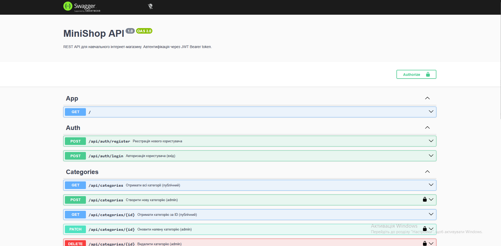

## Student
- Name: Данііл Коломієць
- Group: 232/2 он
 
## Практичне заняття №6 — Interceptors + Exception Filters + Swagger
 
### Структура репозиторію
```
.
├── src/
│   ├── auth/ ...
│   ├── users/ ...
│   ├── categories/ ...
│   ├── products/ ...
│   ├── common/
│   │   ├── enums/
│   │   │   └── role.enum.ts
│   │   ├── guards/
│   │   │   ├── jwt-auth.guard.ts
│   │   │   └── roles.guard.ts
│   │   ├── decorators/
│   │   │   ├── current-user.decorator.ts
│   │   │   └── roles.decorator.ts
│   │   ├── interceptors/
│   │   │   ├── logging.interceptor.ts
│   │   │   └── transform.interceptor.ts
│   │   ├── filters/
│   │   │   └── http-exception.filter.ts
│   │   └── pipes/
│   │   	└── trim.pipe.ts
│   ├── migrations/
│   ├── main.ts
│   └── app.module.ts
├── swagger-screenshot.png
├── Dockerfile
├── docker-compose.yml
└── README.md
```
 
### Запуск проекту
```bash
cp .env.example .env
docker compose up --build
```
 
### Swagger UI
http://localhost:3000/api/docs
 

 
### Формат успішної відповіді
```json
{
  "data": { ... },
  "statusCode": 200,
  "timestamp": "2025-01-15T10:30:00.000Z"
}
```
 
### Формат помилки
```json
{
  "error": {
	"code": 400,
	"message": "Validation failed",
	"details": ["name must be longer..."],
	"traceId": "a1b2c3..."
  },
  "timestamp": "2025-01-15T10:31:00.000Z"
}
```
 
### Приклад логів (LoggingInterceptor)
```text
app-1  | [Nest] 29  - 06/11/2026, 9:46:38 AM     LOG [HTTP] POST /api/auth/register тАФ 201 тАФ 90ms
app-1  | [Nest] 29  - 06/11/2026, 9:47:02 AM     LOG [HTTP] POST /api/auth/login тАФ 200 тАФ 62ms
app-1  | [Nest] 29  - 06/11/2026, 10:05:57 AM     LOG [HTTP] GET /api/products тАФ 200 тАФ 10ms
```
 
### Тест помилки з traceId
```text
{"error":{"code":404,"message":"Product #999 not found","traceId":"573b56a2-872f-486e-90f6-f5b3284c7ee7"},"timestamp":"2026-06-11T10:05:03.054Z"}
```
